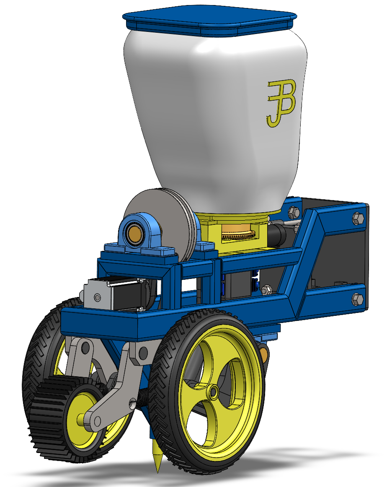

# 🌱 Sistema de semeadura por puncionamento - Sistema de Análise

[](https://repositorio.ufsc.br/handle/123456789/270766)
[](https://www.python.org/)
[]()


Sistema completo de análise cinemática, cálculo de torque e visualização de dados para mecanismo de dosagem de sementes por puncionamento.

**Autor:** José Gabriel Furlan De Barros
**Orientador:** Prof. Sergio Junichi Idehara
**Instituição:** Universidade Federal de Santa Catarina (UFSC)
**Versão:** 2.0

> 📖 **Para detalhes teóricos completos, leia o TCC:** [_Projeto de um sistema de semeadura por puncionamento_](https://repositorio.ufsc.br/handle/123456789/270766)

<p align="center">
  
</p>

---

## 📑 Índice - Navegação Rápida

### 🚀 Começando

- [⚡ Início Rápido (3 passos)](#-início-rápido)
- [🔧 Instalação Completa](#-instalação)
- [💻 Primeiro Uso](#-como-usar)

### 📚 Documentação

- [🎯 Visão Geral do Projeto](#-visão-geral)
- [📁 Estrutura de Arquivos](#-estrutura-do-projeto)
- [📦 Módulos e Funções](#-módulos)
- [⚙️ Configuração](#️-configuração)
- [📊 Exemplos de Código](#-exemplos)

### 🔄 Migração e Reestruturação

- [🏗️ Arquitetura Nova vs Antiga](#️-reestruturação-do-projeto)
- [🗺️ Mapeamento de Funcionalidades](#️-mapeamento-de-funcionalidades)
- [✅ Checklist de Migração](#-checklist-de-migração)

### 🎓 Para o TCC

- [📈 Gráficos e Visualizações](#-gráficos-gerados)
- [🎨 Análises Disponíveis](#-análises-disponíveis)
- [📖 Referência ao Trabalho Completo](#-referência-ao-tcc)

### ❓ Suporte

- [🔍 Solução de Problemas](#-solução-de-problemas)
- [📧 Contato](#-contato)

---

## ⚡ Início Rápido

**3 passos para começar:**

### 1️⃣ Instalar Dependências

```bash
# Opção A: Setup automático (RECOMENDADO - Windows)
.\scripts\setup.ps1    # PowerShell
scripts\setup.bat      # CMD

# Opção B: Manual
pip install -r requirements.txt
```

### 2️⃣ Executar o Sistema

```bash
# Com setup automático
.\scripts\run.ps1      # PowerShell
scripts\run.bat        # CMD

# Manual
python main.py
```

### 3️⃣ Escolher uma Análise no Menu

```
📊 ANÁLISES DISPONÍVEIS:
  1. Análise Cinemática Completa
  2. Análise de Torque e Forças
  3. Distribuição de Sementes (Espaçamento)
  4. Dados IBGE - Área Plantada

⚙️ CONFIGURAÇÕES:
  5. Configurar Parâmetros do Mecanismo
  6. Adicionar Nova Cultura
```

**Pronto!** Os gráficos serão salvos em `output/images/` 🎉

### 🔧 Comandos Úteis

```bash
# Recriar ambiente virtual
Remove-Item -Recurse -Force venv; .\scripts\setup.ps1

# Executar testes
python tests/test_cinematica.py
python tests/test_torque.py
python tests/exemplo_uso.py

# Verificar instalação
python -c "from core import cinematica; print('✅ OK!')"
```

[↑ Voltar ao Índice](#-índice---navegação-rápida)

---

## 🎯 Visão Geral

Este sistema fornece ferramentas completas para análise de mecanismos de dosagem de sementes por puncionamento, desenvolvido como parte do Trabalho de Conclusão de Curso (TCC) na UFSC.

### Funcionalidades Principais

✅ **Análise Cinemática Completa**

- Cálculo de posição, velocidade, aceleração e jerk da haste
- Determinação de ângulos de contato com o solo
- Comparação entre múltiplas culturas

✅ **Análise de Torque e Forças**

- Cálculo de forças na biela (F_B) e manivela (F_M)
- Torque no eixo com modelos de força do solo (F_VS)
- Suporte a F_VS variável, constante ou zero

✅ **Distribuição de Sementes**

- Análise de espaçamento entre sementes
- Cálculo de sementes por metro linear
- Suporte a múltiplas culturas e configurações

✅ **Dados IBGE**

- Visualização de área plantada no Brasil
- Ranking de estados por cultura
- Mapas coropléticos (opcional)

✅ **Configuração Flexível**

- Parâmetros geométricos editáveis
- Massas configuráveis
- Adição de novas culturas via interface

[↑ Voltar ao Índice](#-índice---navegação-rápida)

---

## 🔧 Instalação

### Pré-requisitos

- **Python 3.8+** (recomendado 3.9 ou superior)
- **pip** (gerenciador de pacotes)
- **Sistema Operacional:** Windows, Linux ou macOS

### 🚀 Setup Automático (SUPER RECOMENDADO!)

**Para Windows, use os scripts de setup automático que criam o ambiente virtual e instalam tudo:**

#### Opção 1: PowerShell (Recomendado)

```powershell
# Execute o script de setup
.\scripts\setup.ps1

# Para executar o sistema posteriormente
.\scripts\run.ps1
```

#### Opção 2: CMD/Batch

```cmd
# Execute o script de setup
scripts\setup.bat

# Para executar o sistema posteriormente
scripts\run.bat
```

**O que esses scripts fazem:**

1. ✅ Verificam se Python está instalado
2. ✅ Criam um ambiente virtual (`venv`)
3. ✅ Ativam o ambiente virtual automaticamente
4. ✅ Instalam todas as dependências via `requirements.txt`
5. ✅ Verificam se a instalação foi bem-sucedida
6. ✅ Fornecem instruções claras para uso

**🎉 Vantagens:**

- Ambiente isolado (não afeta outras instalações Python)
- Configuração automática do VS Code
- Um comando e está pronto para usar!

### 📦 Instalação Manual

Se preferir configurar manualmente ou estiver em Linux/macOS:

#### 1. Criar Ambiente Virtual (Recomendado)

```bash
# Criar ambiente virtual
python -m venv venv

# Ativar no Windows (PowerShell)
.\venv\Scripts\Activate.ps1

# Ativar no Windows (CMD)
venv\Scripts\activate.bat

# Ativar no Linux/macOS
source venv/bin/activate
```

#### 2. Instalar Dependências

**Use o arquivo `requirements.txt` para instalar todas as dependências automaticamente:**

```bash
# Instale todas as dependências de uma vez
pip install -r requirements.txt
```


### Verificação da Instalação

```bash
# Teste as importações
python -c "from core import cinematica; print('✅ Instalação OK!')"

# Execute o sistema
python main.py
```

Se tudo estiver correto, você verá a tela de boas-vindas do sistema!

[↑ Voltar ao Índice](#-índice---navegação-rápida)

---

## 💻 Como Usar

### Método 1: Scripts de Execução Rápida (MAIS FÁCIL!)

**Se usou o setup automático, simplesmente execute:**

```powershell
# PowerShell
.\scripts\run.ps1
```

```cmd
# CMD/Batch
scripts\run.bat
```

Esses scripts ativam automaticamente o ambiente virtual e executam o sistema!

### Método 2: Interface CLI (Manual)

Se preferir rodar manualmente:

```bash
# 1. Ative o ambiente virtual (se estiver usando)
.\venv\Scripts\Activate.ps1  # Windows PowerShell
# ou
venv\Scripts\activate.bat    # Windows CMD
# ou
source venv/bin/activate     # Linux/macOS

# 2. Execute o sistema
python main.py
```

**Menu Interativo:**

```
╔═════════════════════════════════════════════════════╗
║   Semeadura por Puncionamento - Sistema de Análise  ║
║  UFSC - José Gabriel Furlan • Prof. Sergio Idehara  ║
╚═════════════════════════════════════════════════════╝

📊 ANÁLISES DISPONÍVEIS:
  1. Análise Cinemática Completa
  2. Análise de Torque e Forças
  3. Distribuição de Sementes (Espaçamento)
  4. Dados IBGE - Área Plantada

⚙️ CONFIGURAÇÕES:
  5. Configurar Parâmetros do Mecanismo
  6. Adicionar Nova Cultura
  7. Sobre / Créditos

  0. Sair
```

### Método 2: Uso Programático

Importe os módulos diretamente em seus scripts:

```python
from core import cinematica as cin
from core import forcas_torque as ft
from core import espacamento as esp
from visualization import plot_cinematica
from utils import config_loader

# Seu código aqui...
```

### Método 3: Uso Programático

Importe os módulos diretamente em seus scripts:

```python
from core import cinematica as cin
from core import forcas_torque as ft
from core import espacamento as esp
from visualization import plot_cinematica
from utils import config_loader

# Seu código aqui...
```

### Método 4: Exemplos Prontos

Execute o arquivo de exemplos:

```bash
python tests/exemplo_uso.py
```

[↑ Voltar ao Índice](#-índice---navegação-rápida)

---

## 📁 Estrutura do Projeto

```
dados/
├── 📄 main.py                    # Interface principal (CLI)
├── 📄 README.md                  # Este arquivo
├── 📄 requirements.txt           # Dependências
│
├── � scripts/                   # Scripts de automação
│   ├── setup.ps1                # Setup automático (PowerShell)
│   ├── setup.bat                # Setup automático (CMD)
│   ├── run.ps1                  # Execução rápida (PowerShell)
│   └── run.bat                  # Execução rápida (CMD)
│
├── 📂 config/                    # Configurações
│   ├── config.yaml              # Parâmetros do mecanismo
│   └── culturas.yaml            # Dados das culturas
│
├── 📂 core/                      # Lógica de negócio (cálculos)
│   ├── __init__.py
│   ├── cinematica.py            # Cinemática do mecanismo
│   ├── forcas_torque.py         # Forças e torque
│   └── espacamento.py           # Espaçamento de sementes
│
├── 📂 data/                      # Processamento de dados
│   ├── __init__.py
│   └── ibge_loader.py           # Dados IBGE
│
├── 📂 visualization/             # Visualizações
│   ├── __init__.py
│   ├── plot_cinematica.py       # Gráficos de cinemática
│   ├── plot_torque.py           # Gráficos de torque
│   ├── plot_espacamento.py      # Gráficos de distribuição
│   └── plot_ibge.py             # Gráficos IBGE
│
├── 📂 utils/                     # Utilitários
│   ├── __init__.py
│   ├── config_loader.py         # Carregamento de configs
│   ├── cinematica.py            # (legado)
│   └── load.py                  # (legado)
│
├── 📂 output/                    # Saídas geradas
│   └── images/                  # Gráficos salvos aqui
│
└── 📂 docs/                      # Documentação adicional
    ├── GUIA_REESTRUTURACAO.md   # Detalhes da reestruturação
    └── INICIO_RAPIDO.md         # Guia de início rápido
```

### Descrição dos Principais Arquivos

| Arquivo                 | Descrição                                             |
| ----------------------- | ----------------------------------------------------- |
| `main.py`               | 🎯 **Comece aqui!** Interface CLI com menu interativo |
| `exemplo_uso.py`        | 📖 Exemplos práticos de uso de todos os módulos       |
| `teste_torque.py`       | ⚡ Teste rápido do cálculo de torque                  |
| `config/config.yaml`    | ⚙️ Parâmetros geométricos e massas                    |
| `config/culturas.yaml`  | 🌾 Dados de todas as culturas                         |
| `core/cinematica.py`    | 📐 Funções de cinemática                              |
| `core/forcas_torque.py` | 💪 Cálculos de forças e torque                        |
| `core/espacamento.py`   | 📏 Espaçamento entre sementes                         |

[↑ Voltar ao Índice](#-índice---navegação-rápida)

---

## 📦 Módulos

### `core/cinematica.py`

**Funções de cinemática do mecanismo:**

| Função                                         | Descrição            | Parâmetros               |
| ---------------------------------------------- | -------------------- | ------------------------ |
| `espaco(theta, r, L, h)`                       | Posição y da haste   | θ (rad), r, L, h (mm)    |
| `velocidade(theta, omega, r, L)`               | Velocidade da haste  | θ (rad), ω (rad/s)       |
| `aceleracao(theta, omega, r, L, alpha)`        | Aceleração da haste  | α = dω/dt (rad/s²)       |
| `jerk(theta, omega, alpha, r, L, beta)`        | Jerk da haste        | β = dα/dt (rad/s³)       |
| `y_solo_mm(theta, r, L, h, altura_centro)`     | Posição ref. ao solo | altura_centro (mm)       |
| `encontrar_theta_solo(r, L, h, altura_centro)` | Ângulos de contato   | Retorna θ descida/subida |
| `velocidade_angular(vt_kmh, N)`                | Calcula ω            | vt (km/h), N (sem/m)     |
| `numero_sementes_por_metro(...)`               | Sementes/metro       | Densidade e germinação   |

**Exemplo:**

```python
from core import cinematica as cin
import numpy as np

theta = np.deg2rad(np.arange(0, 361))
y = cin.espaco(theta, r=84.01, L=210.0, h=347.46)
v = cin.velocidade(theta, omega=20.0, r=84.01, L=210.0)
```

### `core/forcas_torque.py`

**Cálculos de forças e torque:**

| Função                             | Descrição                | Retorno                     |
| ---------------------------------- | ------------------------ | --------------------------- |
| `forcas_FB_FM(theta, ...)`         | Forças na biela/manivela | (F_B, F_M) arrays           |
| `torque(theta, ...)`               | Torque no eixo           | τ array (N·m)               |
| `beta_theta(theta, r, L)`          | Ângulo β da biela        | β array (rad)               |
| `y_theta(theta, r, L, h)`          | Posição (auxiliar)       | y array (m)                 |
| `y_ddot_theta(theta, omega, r, L)` | Aceleração (auxiliar)    | ÿ array (m/s²)              |
| `construir_F_VS_variavel(...)`     | Força do solo variável   | (F_VS, F_max, θ_pico, info) |

**Modelos de F_VS:**

- **Zero:** F_VS = 0 (sem penetração no solo)
- **Constante:** F_VS = valor fixo
- **Variável:** F_VS = k·y² (crescente) → F_max (constante) → 0

**Exemplo:**

```python
from core import forcas_torque as ft
import numpy as np

# Construir F_VS variável
theta_deg = np.linspace(0, 360, 361)
F_VS, F_max, theta_pico, info = ft.construir_F_VS_variavel(
    theta_deg, r=84.01, L=210.0, h=347.46, altura_centro=591.47
)

# Calcular torque
theta_rad = np.deg2rad(theta_deg)
tau = ft.torque(theta_rad, r=0.08401, L=0.210, h=0.34746,
                m_haste=1.16094, m_biela=0.75022,
                P_haste=11.39, P_biela=7.36, F_VS=F_VS, omega=20.0)
```

### `core/espacamento.py`

**Distribuição de sementes:**

| Função                               | Descrição                  |
| ------------------------------------ | -------------------------- |
| `sementes_por_metro(...)`            | Calcula N (sementes/metro) |
| `calcular_espacamento(N, distancia)` | Espaçamento entre sementes |
| `calcular_espacamento_culturas(...)` | Para múltiplas culturas    |

**Exemplo:**

```python
from core import espacamento as esp

N = esp.sementes_por_metro(
    plantas_min=250000, plantas_max=400000,
    rendimento_min=85, rendimento_max=95
)

resultado = esp.calcular_espacamento(N, distancia_metros=3.0)
print(f"Espaçamento: {resultado['espacamento_cm']:.2f} cm")
```

### `visualization/*`

**Módulos de plotagem:**

| Módulo                | Funções                                         | Saída                    |
| --------------------- | ----------------------------------------------- | ------------------------ |
| `plot_cinematica.py`  | `plotar_posicao()`, `plotar_velocidade()`, etc. | Gráficos de cinemática   |
| `plot_torque.py`      | `plotar_torque()`, `plotar_forcas()`            | Gráficos de τ, F_B, F_M  |
| `plot_espacamento.py` | `plotar_distribuicao_sementes()`                | Distribuição de sementes |
| `plot_ibge.py`        | `plotar_area_total()`, `plotar_mapa()`          | Dados agrícolas          |

**Todas as funções de plot aceitam:**

- `mostrar=True/False` - Exibir na tela
- `salvar=True/False` - Salvar em arquivo
- `output_dir='path'` - Diretório de saída

### `data/ibge_loader.py`

**Carregamento de dados do IBGE:**

| Função                          | Descrição                 |
| ------------------------------- | ------------------------- |
| `carregar_dados_ibge()`         | Carrega todas as tabelas  |
| `obter_top_estados(cultura, n)` | Top N estados por cultura |
| `processar_tabela_sintese()`    | Dados nacionais agregados |

### `utils/config_loader.py`

**Gerenciamento de configurações:**

| Função                            | Descrição                       |
| --------------------------------- | ------------------------------- |
| `carregar_config()`               | Carrega `config.yaml`           |
| `carregar_culturas()`             | Carrega `culturas.yaml`         |
| `extrair_faixas_cultura(cultura)` | Dados de uma cultura específica |

[↑ Voltar ao Índice](#-índice---navegação-rápida)

---

## ⚙️ Configuração

### `config/config.yaml`

Parâmetros geométricos e configurações do mecanismo:

```yaml
mechanics:
  crank_radius_mm: 84.01 # r - Raio da manivela
  rod_length_mm: 210.0 # L - Comprimento da biela
  offset_h_mm: 347.46 # h - Altura da haste
  altura_centro_mm: 591.47 # Altura do centro da manivela
  massa_haste_kg: 1.16094 # m_haste
  massa_biela_kg: 0.75022 # m_biela

simulation:
  theta_range_deg: [0, 360]
  n_theta: 10000
```

**Editando pelo Menu:**

- Execute `python main.py`
- Escolha opção **5** (Configurar Parâmetros)
- Altere geometria e/ou massas interativamente

### `config/culturas.yaml`

Dados de todas as culturas suportadas:

```yaml
crops:
  - name: "soja"
    row_spacing_m:
      options: [0.45, 0.50] # Espaçamentos disponíveis
    plant_density_per_hectare:
      min: 250000 # Densidade mínima
      max: 400000 # Densidade máxima
      step: 25000 # Incremento
    planting_speed_kmh:
      min: 5.0 # Velocidade mínima
      max: 7.0 # Velocidade máxima
      step: 0.5
    germination_rate:
      min: 0.85 # Taxa de germinação (0-1)
      max: 0.95
      step: 0.01
```

**Culturas incluídas:**

- Soja
- Milho
- Sorgo
- Feijão
- Algodão
- Girassol

**Adicionando nova cultura:**

- Execute `python main.py`
- Escolha opção **6** (Adicionar Nova Cultura)
- Siga o assistente interativo
- Copie o YAML gerado para `config/culturas.yaml`

[↑ Voltar ao Índice](#-índice---navegação-rápida)

---

## 📊 Exemplos

### Exemplo 1: Análise Cinemática Completa

```python
from core import cinematica as cin
import numpy as np
import matplotlib.pyplot as plt

# Parâmetros geométricos (mm)
r, L, h = 84.01, 210.0, 347.46
altura_centro = 591.47

# Velocidade angular (rad/s)
omega = 20.0

# Vetor de ângulos
theta_deg = np.arange(0, 361)
theta_rad = np.deg2rad(theta_deg)

# Calcular cinemática
y_solo = cin.y_solo_mm(theta_rad, r, L, h, altura_centro)
v = cin.velocidade(theta_rad, omega, r, L)
a = cin.aceleracao(theta_rad, omega, r, L, alpha=0)

# Estatísticas
print(f"Profundidade máxima: {np.min(y_solo):.2f} mm")
print(f"Velocidade máxima: {np.max(np.abs(v)):.2f} mm/s")
print(f"Aceleração máxima: {np.max(np.abs(a)):.2f} mm/s²")

# Ângulos de contato com o solo
theta_solo = cin.encontrar_theta_solo(r, L, h, altura_centro)
print(f"θ descida: {theta_solo['descida']:.2f}°")
print(f"θ subida: {theta_solo['subida']:.2f}°")
```

**Saída esperada:**

```
Profundidade máxima: -47.15 mm
Velocidade máxima: 2841.35 mm/s
Aceleração máxima: 95823.47 mm/s²
θ descida: 123.28°
θ subida: 236.72°
```

### Exemplo 2: Calcular Torque com F_VS Variável

```python
from core import forcas_torque as ft
import numpy as np

# Parâmetros geométricos (mm)
R_MM, L_MM, H_MM = 84.01, 210.0, 347.46
ALTURA_CENTRO_MM = 591.47

# Massas (kg)
m_haste, m_biela = 1.16094, 0.75022
P_haste = m_haste * 9.81
P_biela = m_biela * 9.81

# Velocidade angular
omega = 20.0  # rad/s

# Ângulos
theta_deg = np.linspace(0, 360, 361)
theta_rad = np.deg2rad(theta_deg)

# Construir F_VS variável
F_VS, F_max, theta_pico, info = ft.construir_F_VS_variavel(
    theta_deg, R_MM, L_MM, H_MM, ALTURA_CENTRO_MM
)

print("Parâmetros do modelo F_VS:")
print(f"  θ início: {info['theta_inicio']:.2f}°")
print(f"  θ pico: {info['theta_pico']:.2f}°")
print(f"  θ fim: {info['theta_fim']:.2f}°")
print(f"  F_VS máximo: {info['F_max']:.2f} N")

# Converter para metros
r_m = R_MM / 1000
L_m = L_MM / 1000
h_m = H_MM / 1000

# Calcular forças
F_B, F_M = ft.forcas_FB_FM(
    theta_rad, r_m, L_m, h_m,
    m_haste, m_biela, P_haste, P_biela, F_VS, omega
)

# Calcular torque
tau = ft.torque(
    theta_rad, r_m, L_m, h_m,
    m_haste, m_biela, P_haste, P_biela, F_VS, omega
)

# Resultados
print(f"\nResultados:")
print(f"  Torque máximo: {np.max(np.abs(tau)):.4f} N·m")
print(f"  F_B máximo: {np.max(np.abs(F_B)):.2f} N")
print(f"  F_M máximo: {np.max(np.abs(F_M)):.2f} N")
```

**Saída esperada:**

```
Parâmetros do modelo F_VS:
  θ início: 123.28°
  θ pico: 168.00°
  θ fim: 180.00°
  F_VS máximo: 419.25 N

Resultados:
  Torque máximo: 12.0015 N·m
  F_B máximo: 361.65 N
  F_M máximo: 373.84 N
```

### Exemplo 3: Distribuição de Sementes por Cultura

```python
from core import espacamento as esp
from utils import config_loader

# Carregar dados de todas as culturas
culturas_yaml = config_loader.carregar_culturas()

# Preparar dicionário de culturas
culturas_dict = {}
for nome, dados in culturas_yaml.items():
    dens = dados['plant_density_per_hectare']
    germ = dados['germination_rate']
    culturas_dict[nome] = {
        'dens_min': dens['min'],
        'dens_max': dens['max'],
        'germ_min': germ['min'],
        'germ_max': germ['max']
    }

# Calcular espaçamento para 3 metros
distancia = 3.0
resultados = esp.calcular_espacamento_culturas(culturas_dict, distancia)

# Exibir resultados
for cultura, res in resultados.items():
    print(f"\n{cultura.upper()}:")
    print(f"  Sementes/metro: {res['sementes_por_metro']:.2f}")
    print(f"  Espaçamento: {res['espacamento_cm']:.2f} cm")
    print(f"  Total em {distancia}m: {res['total_sementes']:.0f} sementes")
```

**Saída esperada:**

```
SOJA:
  Sementes/metro: 8.23
  Espaçamento: 12.15 cm
  Total em 3.0m: 25 sementes

MILHO:
  Sementes/metro: 1.55
  Espaçamento: 64.52 cm
  Total em 3.0m: 5 sementes

...
```

[↑ Voltar ao Índice](#-índice---navegação-rápida)

---

## 🏗️ Reestruturação do Projeto

### Arquitetura Antiga vs Nova

#### ❌ ANTES (Código Antigo)

```
dados/
├── espacamento.py              # Código misturado: cálculo + plot
├── graficos_cinematica.py      # Código misturado: cálculo + plot
├── ibge_graos.py               # Código misturado: dados + plot
├── torque.py                   # Código misturado: cálculo + plot
├── config/
└── utils/
    ├── cinematica.py           # Funções duplicadas
    └── load.py
```

**Problemas:**

- ❌ Funções duplicadas em múltiplos arquivos
- ❌ Cálculos e visualização misturados
- ❌ Difícil de manter e testar
- ❌ Sem interface unificada
- ❌ Sem documentação

#### ✅ DEPOIS (Código Novo)

```
dados/
├── main.py                     # ✨ Interface CLI unificada
├── exemplo_uso.py              # ✨ Exemplos de uso
├── README.md                   # ✨ Documentação completa
│
├── core/                       # ✨ Lógica de negócio separada
│   ├── cinematica.py          # Funções consolidadas
│   ├── forcas_torque.py       # Cálculos de torque
│   └── espacamento.py         # Espaçamento de sementes
│
├── visualization/              # ✨ Visualização separada
│   ├── plot_cinematica.py
│   ├── plot_torque.py
│   ├── plot_espacamento.py
│   └── plot_ibge.py
│
├── data/                       # ✨ Dados separados
│   └── ibge_loader.py
│
├── utils/                      # ✨ Utilitários refatorados
│   └── config_loader.py
│
└── output/images/              # ✨ Saídas organizadas
```

**Melhorias:**

- ✅ Separação clara de responsabilidades
- ✅ Funções únicas e reutilizáveis
- ✅ Fácil de manter e testar
- ✅ Interface CLI profissional
- ✅ Documentação completa

### Princípios da Nova Arquitetura

1. **Separação de Responsabilidades (SoC)**

   - Cálculos → `core/`
   - Visualização → `visualization/`
   - Dados → `data/`
   - Configuração → `utils/`

2. **DRY (Don't Repeat Yourself)**

   - Funções únicas em um só lugar
   - Reutilização via imports

3. **Modularidade**

   - Módulos independentes
   - Fácil de testar isoladamente

4. **Interface Unificada**
   - Menu CLI para todas as funcionalidades
   - Uso programático também suportado

[↑ Voltar ao Índice](#-índice---navegação-rápida)

---

## 🗺️ Mapeamento de Funcionalidades

### Cinemática

| Função Antiga            | Nova Localização                         | Módulo               |
| ------------------------ | ---------------------------------------- | -------------------- |
| `espaco()`               | `core.cinematica.espaco()`               | `core/cinematica.py` |
| `velocidade()`           | `core.cinematica.velocidade()`           | `core/cinematica.py` |
| `aceleracao()`           | `core.cinematica.aceleracao()`           | `core/cinematica.py` |
| `jerk()`                 | `core.cinematica.jerk()`                 | `core/cinematica.py` |
| `encontrar_theta_solo()` | `core.cinematica.encontrar_theta_solo()` | `core/cinematica.py` |
| `velocidade_angular()`   | `core.cinematica.velocidade_angular()`   | `core/cinematica.py` |

### Torque e Forças

| Função Antiga               | Nova Localização                               | Módulo                  |
| --------------------------- | ---------------------------------------------- | ----------------------- |
| `torque()`                  | `core.forcas_torque.torque()`                  | `core/forcas_torque.py` |
| `forcas_FB_FM()`            | `core.forcas_torque.forcas_FB_FM()`            | `core/forcas_torque.py` |
| `beta_theta()`              | `core.forcas_torque.beta_theta()`              | `core/forcas_torque.py` |
| `construir_F_VS_variavel()` | `core.forcas_torque.construir_F_VS_variavel()` | `core/forcas_torque.py` |

### Espaçamento

| Função Antiga            | Nova Localização                          | Módulo                |
| ------------------------ | ----------------------------------------- | --------------------- |
| `quantidade()`           | `core.espacamento.sementes_por_metro()`   | `core/espacamento.py` |
| `calcular_espacamento()` | `core.espacamento.calcular_espacamento()` | `core/espacamento.py` |

### Visualização

| Script Antigo            | Nova Localização                    | Funções                                         |
| ------------------------ | ----------------------------------- | ----------------------------------------------- |
| `graficos_cinematica.py` | `visualization/plot_cinematica.py`  | `plotar_posicao()`, `plotar_velocidade()`, etc. |
| `espacamento.py` (plot)  | `visualization/plot_espacamento.py` | `plotar_distribuicao_sementes()`                |
| `ibge_graos.py` (plots)  | `visualization/plot_ibge.py`        | `plotar_area_total()`, `plotar_mapa()`, etc.    |
| `torque.py` (plots)      | `visualization/plot_torque.py`      | `plotar_torque()`, `plotar_forcas()`            |

### Dados

| Script Antigo           | Nova Localização      | Funções                       |
| ----------------------- | --------------------- | ----------------------------- |
| `ibge_graos.py` (dados) | `data/ibge_loader.py` | `carregar_dados_ibge()`, etc. |

### Configuração

| Script Antigo   | Nova Localização         | Mudanças                  |
| --------------- | ------------------------ | ------------------------- |
| `utils/load.py` | `utils/config_loader.py` | Refatorado e simplificado |

[↑ Voltar ao Índice](#-índice---navegação-rápida)

---

## 📈 Gráficos Gerados

Todos os gráficos são salvos automaticamente em `output/images/`:

### Cinemática

| Arquivo                           | Descrição       | Conteúdo                                  |
| --------------------------------- | --------------- | ----------------------------------------- |
| `grafico_posicao_haste.png`       | Posição y vs θ  | Curva de deslocamento com ângulos de solo |
| `grafico_velocidade_haste.png`    | Velocidade vs θ | Múltiplas culturas comparadas             |
| `grafico_aceleracao_haste.png`    | Aceleração vs θ | Múltiplas culturas comparadas             |
| `grafico_jerk_haste.png`          | Jerk vs θ       | Múltiplas culturas comparadas             |
| `grafico_cinematica_completo.png` | 4 em 1          | Posição + velocidade + aceleração + jerk  |

### Torque e Forças

| Arquivo                    | Descrição   | Conteúdo                     |
| -------------------------- | ----------- | ---------------------------- |
| `grafico_torque.png`       | Torque vs θ | Destaca região de F_VS ativa |
| `grafico_forcas_FB_FM.png` | Forças vs θ | F_B e F_M no mesmo gráfico   |

### Espaçamento

| Arquivo                     | Descrição           | Conteúdo           |
| --------------------------- | ------------------- | ------------------ |
| `distribuicao_sementes.png` | Distribuição linear | Barras por cultura |

### IBGE

| Arquivo                    | Descrição              | Conteúdo                                         |
| -------------------------- | ---------------------- | ------------------------------------------------ |
| `area_culturas_brasil.png` | Área total por cultura | Gráfico de barras nacional                       |
| `ranking_estados_*.png`    | Top 10 estados         | Por cultura específica                           |
| `mapa_*_ha.png`            | Mapa coroplético       | Distribuição geográfica (se geopandas instalado) |

### Características dos Gráficos

✅ **Alta qualidade** - DPI 300, adequado para TCC
✅ **Bem formatados** - Grid, legendas, anotações
✅ **Informativos** - Valores máximos destacados
✅ **Comparativos** - Múltiplas culturas no mesmo plot
✅ **Destacados** - Regiões importantes (F_VS, solo) em cores

[↑ Voltar ao Índice](#-índice---navegação-rápida)

---

## 🎨 Análises Disponíveis

### 1️⃣ Análise Cinemática Completa

**O que faz:**

- Calcula posição, velocidade, aceleração e jerk
- Determina ângulos de contato com o solo
- Compara múltiplas culturas
- Gera gráficos individuais e comparativos

**Como usar:**

```bash
python main.py → Opção 1
```

**Opções:**

- Uma cultura específica
- Todas as culturas (comparativo)
- Velocidade angular personalizada

**Gráficos gerados:** 5 arquivos PNG

### 2️⃣ Análise de Torque e Forças

**O que faz:**

- Calcula forças na biela (F_B) e manivela (F_M)
- Calcula torque no eixo
- Suporta 3 modelos de F_VS: zero, constante, variável
- Exibe parâmetros do modelo F_VS

**Como usar:**

```bash
python main.py → Opção 2
```

**Configurações:**

- **F_VS zero:** Sem força do solo
- **F_VS constante:** Valor fixo definido pelo usuário
- **F_VS variável:** Modelo completo (recomendado)

**Velocidade angular:**

- Teste padrão (20 rad/s) - recomendado
- Por cultura (mostra todas as opções)
- Manual

**Gráficos gerados:** 2 arquivos PNG

### 3️⃣ Distribuição de Sementes

**O que faz:**

- Calcula sementes por metro linear
- Determina espaçamento entre sementes
- Compara todas as culturas
- Gera visualização em barras

**Como usar:**

```bash
python main.py → Opção 3
```

**Entrada:** Distância a analisar (ex: 3.0 metros)

**Gráficos gerados:** 1 arquivo PNG

### 4️⃣ Dados IBGE - Área Plantada

**O que faz:**

- Carrega dados de produção agrícola do IBGE
- Gera ranking de estados por cultura
- Cria mapas coropléticos (se geopandas instalado)
- Visualiza área total nacional por cultura

**Como usar:**

```bash
python main.py → Opção 4
```

**Opções:**

- Área total de todas as culturas
- Ranking de estados por cultura
- Mapa coroplético (requer geopandas)

**Gráficos gerados:** Vários PNG conforme seleção

### 5️⃣ Configurar Parâmetros do Mecanismo

**O que faz:**

- Permite editar parâmetros geométricos (r, L, h, altura_centro)
- Permite editar massas (m_haste, m_biela)
- Exibe valores atuais antes de editar
- Valida entradas

**Como usar:**

```bash
python main.py → Opção 5
```

**Alterações afetam:** Todos os cálculos subsequentes na mesma sessão

### 6️⃣ Adicionar Nova Cultura

**O que faz:**

- Assistente interativo para nova cultura
- Coleta todos os parâmetros necessários
- Gera YAML formatado para copiar
- Fornece instruções de onde colar

**Como usar:**

```bash
python main.py → Opção 6
```

**Dados solicitados:**

- Nome da cultura
- Espaçamentos entre linhas
- Densidade de plantio (min, max, step)
- Velocidade de plantio (min, max, step)
- Taxa de germinação (min, max, step)

[↑ Voltar ao Índice](#-índice---navegação-rápida)

---

## ✅ Checklist de Migração

### Para Usuários Migrando do Código Antigo

- [ ] Instalar dependências: `pip install -r requirements.txt`
- [ ] Verificar que `python main.py` funciona
- [ ] Testar pelo menos uma análise de cada tipo
- [ ] Verificar que gráficos são salvos em `output/images/`
- [ ] Revisar novos nomes de funções no [mapeamento](#️-mapeamento-de-funcionalidades)
- [ ] Atualizar scripts próprios com novos imports:

  ```python
  # Antigo
  from utils.cinematica import espaco

  # Novo
  from core.cinematica import espaco
  ```

- [ ] Testar scripts atualizados
- [ ] (Opcional) Mover arquivos antigos para backup

### Importações a Atualizar

```python
# ❌ ANTIGO
from utils.cinematica import espaco, velocidade
from espacamento import quantidade
import graficos_cinematica

# ✅ NOVO
from core.cinematica import espaco, velocidade
from core.espacamento import sementes_por_metro
from visualization import plot_cinematica
```

### Mudanças de Nomenclatura

| Antigo             | Novo                   |
| ------------------ | ---------------------- |
| `quantidade()`     | `sementes_por_metro()` |
| `utils.cinematica` | `core.cinematica`      |
| `utils.load`       | `utils.config_loader`  |
| `graficos_*`       | `visualization.plot_*` |

[↑ Voltar ao Índice](#-índice---navegação-rápida)

---

## 🔍 Solução de Problemas

### Erro: ModuleNotFoundError

**Problema:** `ModuleNotFoundError: No module named 'numpy'`

**Solução:**

```bash
pip install -r requirements.txt
```

### Erro: Importação falha

**Problema:** `ModuleNotFoundError: No module named 'core'`

**Solução:** Certifique-se de estar no diretório correto:

```bash
cd c:\Projeto\dados
python main.py
```

### Gráficos não aparecem

**Problema:** Os gráficos são salvos mas não exibidos

**Solução:** Use `mostrar=True` nas funções de plot ou escolha "s" quando perguntado

### Dados IBGE não carregam

**Problema:** Erro ao carregar dados do IBGE

**Solução:** Verifique se a pasta `data/` contém os arquivos CSV do IBGE ou se o sistema tem acesso à internet para download

### Performance lenta

**Problema:** Cálculos muito lentos

**Solução:**

- Reduza `n_theta` em `config.yaml`
- Use menos culturas para comparação
- Verifique se NumPy está instalado corretamente

### Erros de encoding

**Problema:** `UnicodeDecodeError` ao carregar dados

**Solução:**

```bash
pip install unidecode
```

### Mapas coropléticos não funcionam

**Problema:** Erro ao gerar mapas

**Solução:** Instale dependências opcionais:

```bash
pip install geopandas geobr
```

[↑ Voltar ao Índice](#-índice---navegação-rápida)

---

## 📖 Referência ao TCC

### Trabalho Completo

Para entender em profundidade a teoria, modelagem matemática, validação experimental e resultados completos, consulte o Trabalho de Conclusão de Curso:

🎓 **[Projeto de um sistema de semeadura por puncionamento](https://repositorio.ufsc.br/handle/123456789/270766)**

**Autor:** José Gabriel Furlan De Barros
**Orientador:** Prof. Sergio Junichi Idehara
**Instituição:** Universidade Federal de Santa Catarina (UFSC)
**Curso:** Engenharia Mecânica
**Ano:** 2025

### Conteúdo do TCC

O trabalho apresenta:

- 🔬 **Fundamentação Teórica:** Cinemática e dinâmica de mecanismos
- 📐 **Modelagem Matemática:** Equações completas do sistema
- 🧪 **Validação Experimental:** Testes e comparações
- 📊 **Resultados:** Análises de desempenho e otimização
- 🌾 **Aplicação Agrícola:** Contexto e importância
- 🔧 **Projeto Mecânico:** Desenhos e especificações

### Como Citar

```bibtex
@thesis{barros2025dosador,
  author = {Barros, José Gabriel Furlan De},
  title = {Projeto de um sistema de semeadura por puncionamento},
  school = {Universidade Federal de Santa Catarina},
  year = {2025},
  type = {Trabalho de Conclusão de Curso},
  url = {https://repositorio.ufsc.br/handle/123456789/270766}
}
```

### Relação com Este Software

Este repositório contém o **software de análise** desenvolvido como parte do TCC:

- ✅ Implementa todas as equações do trabalho
- ✅ Gera todos os gráficos apresentados
- ✅ Permite reproduzir os resultados
- ✅ Estende a análise para múltiplas culturas
- ✅ Fornece interface de uso amigável

[↑ Voltar ao Índice](#-índice---navegação-rápida)

---

## 🤝 Contribuindo

Este é um projeto acadêmico desenvolvido como parte de um TCC. Sugestões e melhorias são bem-vindas.

### Como Contribuir

1. Fork o projeto
2. Crie uma branch para sua feature (`git checkout -b feature/MinhaFeature`)
3. Commit suas mudanças (`git commit -m 'Adiciona MinhaFeature'`)
4. Push para a branch (`git push origin feature/MinhaFeature`)
5. Abra um Pull Request

### Diretrizes

- Mantenha a estrutura modular
- Adicione docstrings às funções
- Teste seu código
- Atualize a documentação se necessário

[↑ Voltar ao Índice](#-índice---navegação-rápida)

---

## 📧 Contato

**Autor:** José Gabriel Furlan De Barros
**Orientador:** Prof. Sergio Junichi Idehara
**Instituição:** Universidade Federal de Santa Catarina (UFSC)

Para dúvidas ou suporte sobre este software:

- 📖 Consulte a [documentação adicional](docs/)
- 🎓 Leia o [TCC completo](https://repositorio.ufsc.br/handle/123456789/270766)
- 💬 Entre em contato via repositório do projeto

[↑ Voltar ao Índice](#-índice---navegação-rápida)

---

## 📝 Licença

Projeto acadêmico - TCC José Gabriel Furlan De Barros
Universidade Federal de Santa Catarina (UFSC) - 2025

---

## 🏆 Agradecimentos

- Prof. Sergio Junichi Idehara (orientador)
- Universidade Federal de Santa Catarina (UFSC)
- Departamento Laboratorio de Sistemas Veiculares (LSV)

---

<div align="center">

**Desenvolvido na UFSC**

[](https://repositorio.ufsc.br/handle/123456789/270766)
[](https://www.python.org/)

**Última atualização:** Dezembro 2025

[↑ Voltar ao Topo](#-dosador-de-sementes---sistema-de-análise)

</div>
